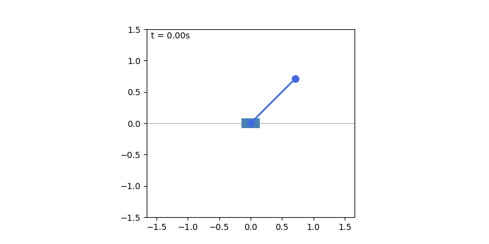
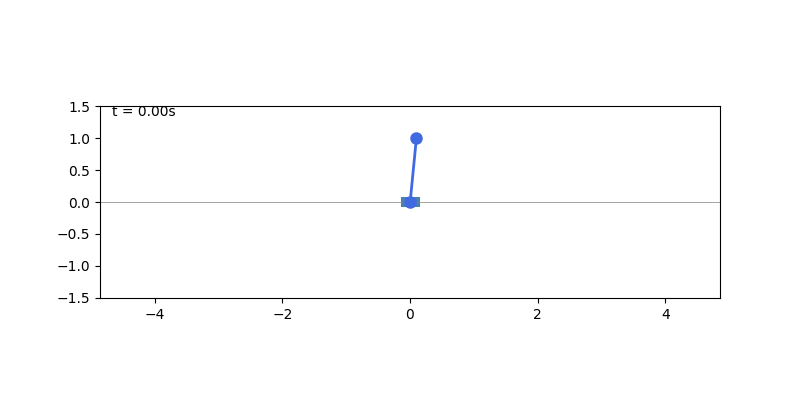
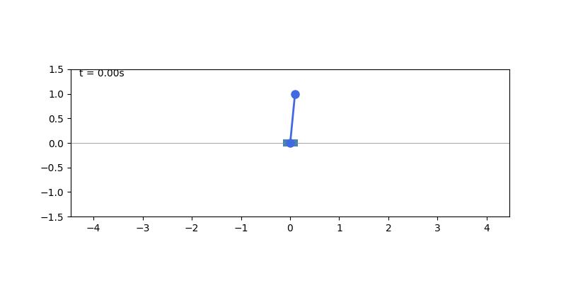
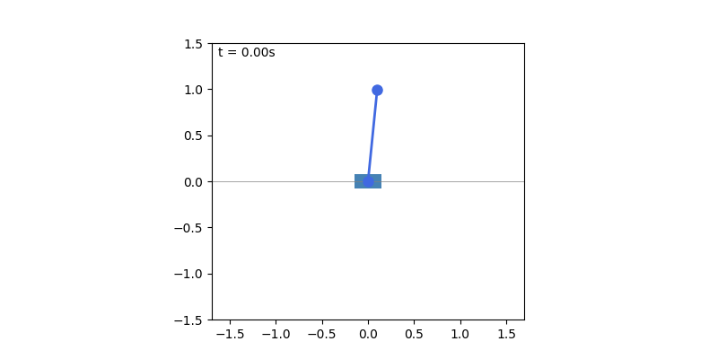
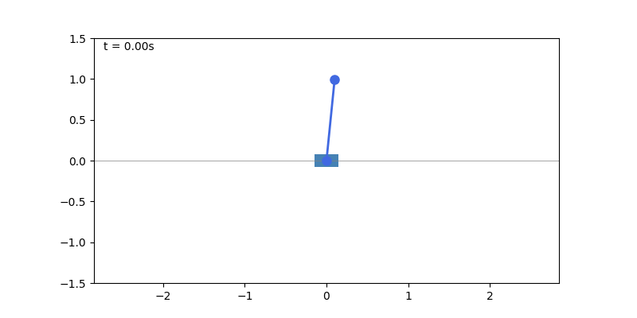
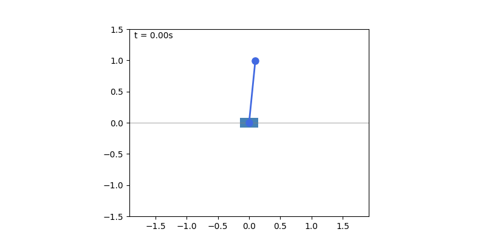

# EE5311 Group8

using `uv` for python env

## start
```sh
uv sync  # if ur computer only has integrate gpu or..
uv sync --extra cuda # if u have nvidia card
```
do `uv add <package name>` to install package u need

## project structure

```
src/
  pendulum/
    physics.py    - cart-pole ODE + RK4 integrator, all in jax so its differentiable
    visualize.py  - trajectory plots + cart-pole animation (gif)
  controllers/
    pid.py              - PID controller (manual tuning)
    optimize_pid.py     - PID param optimization via adam (autodiff through physics)
    optimize_pid_lbfgs.py - PID param optimization via l-bfgs (second order)
    neural.py           - NN policy (MLP 5→512→512→1, equinox), trained via BPTT through differentiable sim
  pendulum/
    env.py              - gymnasium wrapper around our physics (pure numpy, for RL baselines)
```

## run

```sh
# compare manual pid vs adam-optimized pid
uv run tests/test_compare_optimizers.py

# neural network controller (train from scratch, saves to data/neural/policy.eqx)
uv run tests/test_neural.py

# load saved model (skip training)
uv run tests/test_neural.py --load

# PPO baseline (model-free RL, uses stable-baselines3)
uv run python tests/test_ppo.py

# load saved ppo model
uv run python tests/test_ppo.py --load
```

## method overview

1. **differentiable physics** - cart-pole dynamics written in jax, so jax.grad can backprop through the simulator
2. **PID baseline** - manual params → optimize with adam (1st order) and l-bfgs (2nd order) via autodiff
3. **neural network** - MLP policy trained end-to-end through physics sim (BPTT), gradient clipping, multi-seed for robustness
4. **PPO baseline** - model-free RL via stable-baselines3, same env same reward, just doesnt know the physics
5. loss = (1-cos θ)² + 0.1·x² + 0.1·θ̇² + 0.001·force² (penalize tip height deficit, position, velocity, energy)

## results

no control (just physics):



| manual PID | adam-optimized PID | L-BFGS-optimized PID |
|:---:|:---:|:---:|
|  |  |  |

| neural network (ours) | PPO (model-free RL) |
|:---:|:---:|
|  |  |

## external
- https://en.wikipedia.org/wiki/Inverted_pendulum
